<div align="center">

# pr-replies

**Turn GitHub PR & GitLab MR review feedback into one live, keyboard-first browser session — triage, fix, and reply, without the terminal back-and-forth.**

[](LICENSE)


</div>

Drives your coding agent — [Claude Code](https://code.claude.com) or
[OpenAI Codex](https://developers.openai.com/codex). Point it at an open **GitHub
pull request** or **GitLab merge request** and it opens a **single browser tab**
that walks you through the whole loop: triage every comment, watch the agent
implement the approved fixes live, then pick and edit replies and post them.

Everything runs locally on `127.0.0.1` behind a random URL token. The only network
calls are the `gh` / `glab` CLI talking to GitHub/GitLab with the auth you already
have — **the tool never sees, handles, or stores a token.**

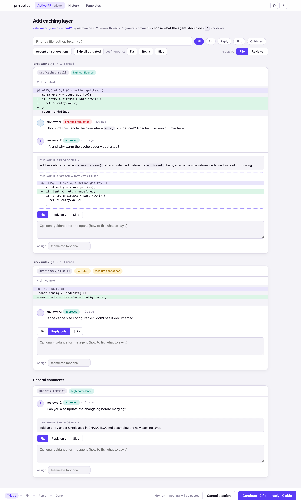

## Highlights

- **One browser session for the whole loop** — triage → fix → reply, in a single tab.
- **AI triage you stay in control of** — the agent proposes a per-comment plan with a **confidence badge** and, for high-confidence fixes, a **sketched diff**. You pick **Fix / Reply only / Skip**, informed by your repo's history of what you've fixed vs. replied to.
- **Live fix progress** — per-fix status, test checks, commit SHAs, and the push, streamed in real time, with an **Abort** at any point.
- **Dual reply drafts** — a **Direct / fix-plan** and a warmer **Humanized** draft, side by side; pick one and tweak it.
- **Committable suggestions** — for a single-hunk fix, optionally append a GitHub/GitLab **`suggestion` block** so the reviewer applies the exact change from the PR — works on forks and self-managed hosts where the web button doesn't.
- **Real diffs, not hallucinations** — each reply shows the **actual fix commit diff read from git**, not from the model's memory.
- **Agent-agnostic** — runs under **Claude Code** (plugin) or **OpenAI Codex** (skill) off one shared, zero-dependency core.
- **Keyboard-first & accessible** — `j`/`k`, `1`/`2`/`3`, `⌘↩`, with filtering, batch actions, file/reviewer grouping, live-region announcements, focus management, and `prefers-reduced-motion`.
- **Team-friendly, still local** — an **Open PRs** picker, assign comments to teammates, optional @-mentions, an opt-in **summary comment**, a **History** audit log, and reusable **reply templates**.
- **Light / dark / system** theme, and edits that survive refreshes, timeouts, and even a server restart.
- **GitHub + GitLab** (incl. self-managed), auto-detected from your git remote.
- **Zero build, zero runtime dependencies** — the React UI ships as vendored static files, served unbundled.

## The three phases

### 1 · Triage

The agent fetches the unresolved review threads / MR discussions plus general
comments, reads your code, and proposes a plan per comment — each with a
**confidence badge** and, for high-confidence fixes, a **sketched diff** (marked
*not yet applied*). Choose **Fix / Reply only / Skip**, filter, run batch actions,
and **group by file or reviewer**.


It's keyboard-first throughout — press `?` for the shortcut sheet, or group by
reviewer to route comments to teammates:

<table>
<tr>
<td>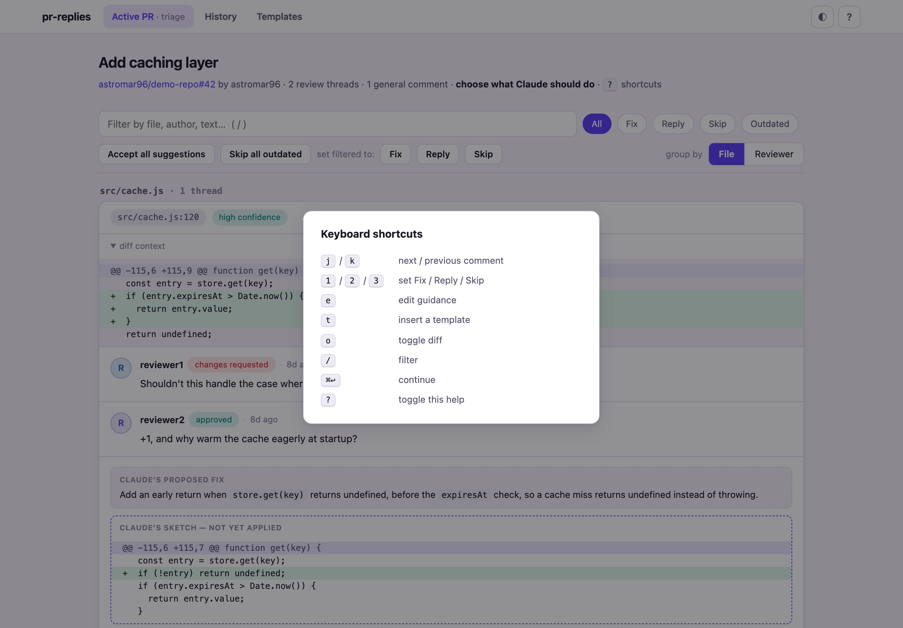</td>
<td>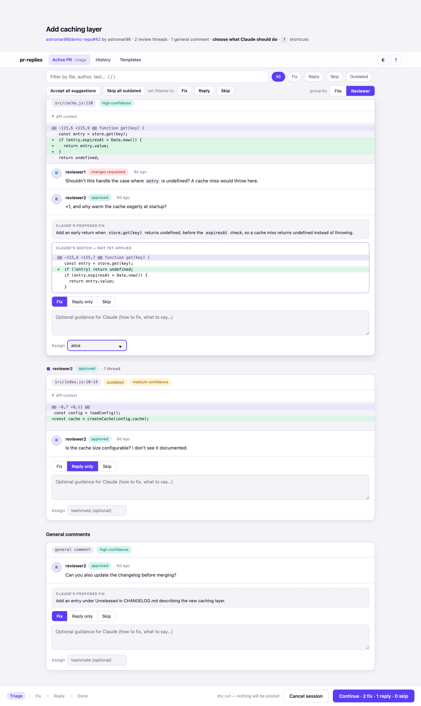</td>
</tr>
</table>

### 2 · Fix (live)

The same tab switches to a progress view while the agent implements the approved
fixes: per-fix status, test checks, commit SHAs, and the push, **streamed live**.
**Abort** hands control back at any point — keep the tab open; replies come next.

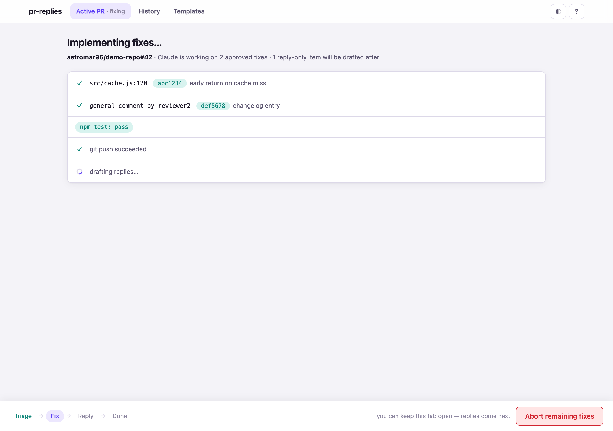

### 3 · Reply

The agent writes **two variants per comment** — a **Direct / fix-plan** draft and
a warmer **Humanized** one — shown side by side. Pick one (`v` toggles), tweak it,
and review the **actual fix commit diff** (read from git) with a markdown-preview
toggle and a **Resolve thread** checkbox.

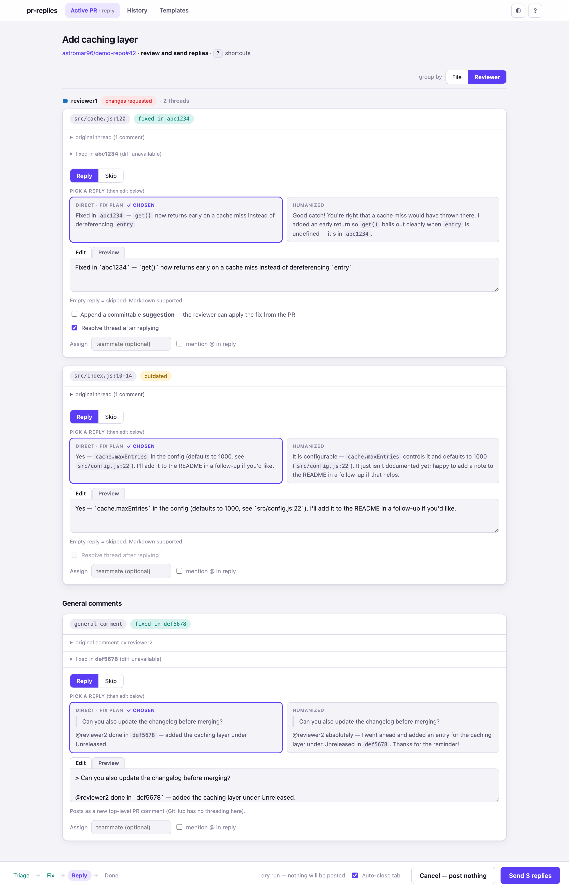

For a fix that's a single contiguous hunk on the commented lines, the agent can
attach a **committable suggestion**. Tick **Append a committable suggestion** and
the reply carries a `` ```suggestion `` block the reviewer can apply in one click —
including on **forks** and **self-managed** hosts where the web "add suggestion"
button isn't available. The suggestion text is read from the validated payload
(never the browser), so it always matches the pushed fix.

Hit **Send** — the server posts via `gh` / `glab` with rate-limit retries,
resolves the threads you ticked, and streams per-item status back. Partial
failures stay on screen with **Retry failed / Finish anyway**.

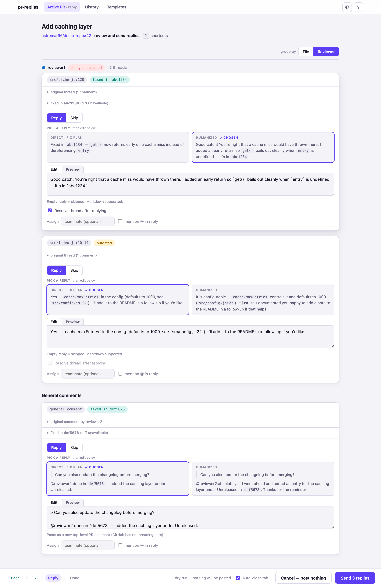

### Done

A summary of what was posted, resolved, and fixed — then back to your agent
session for the recap. One click **posts an opt-in summary comment** to the PR/MR
(replies posted, threads resolved, fixes pushed) so reviewers get a notification —
replying inside threads notifies no one. It's posted at most once per session and
survives a restart.

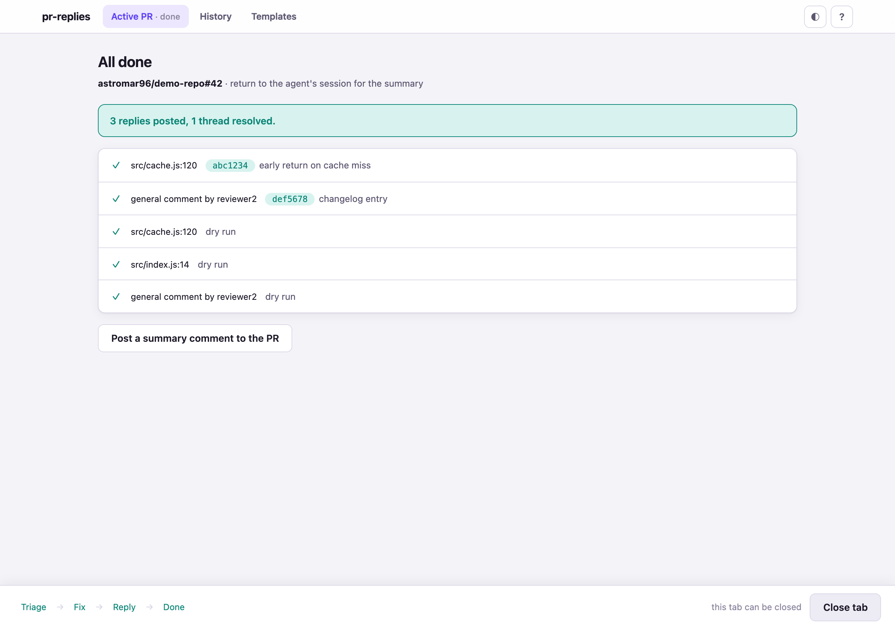

## The hub — Open PRs, History & Templates

These make pr-replies feel like a team tool while staying **local** — each
developer runs it on their own machine with their own `gh`/`glab` auth. No hosted
server, no accounts. Open it with `/pr-dashboard` (no PR needed).

**Open PRs** — a picker of the current repo's open pull/merge requests (provider
auto-detected from the remote), so you can see what's waiting and jump in. Pick
one and run `/pr-replies N` to start a session on it.

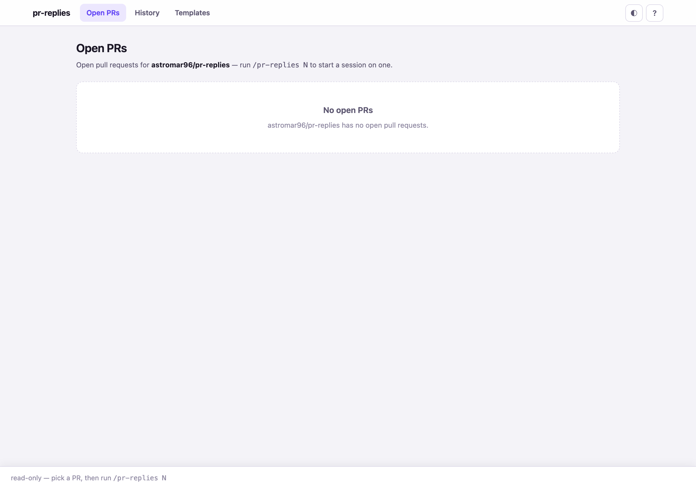

**History** — an audit log of every finished session (what was posted, resolved,
and fixed, with commit SHAs and timestamps), written automatically.

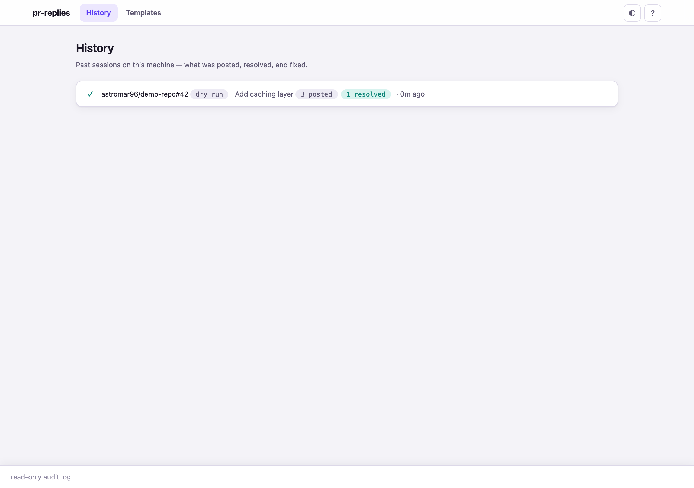

**Templates** — reusable reply snippets. Press `t` while drafting to insert one,
with `{{author}}`, `{{sha}}`, `{{path}}`, `{{pr}}`, `{{repo}}`, and `{{line}}`
filled in. Yours live in `~/.config/pr-replies/templates.json`; a repo can ship
shared read-only templates in `.pr-replies/templates.json` (merged in, user wins).

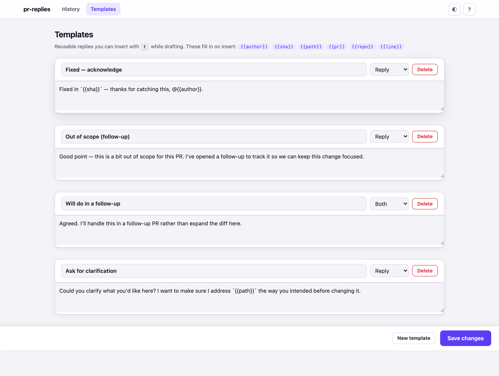

**Reviewer routing** — group triage/reply by reviewer, assign a comment to a
teammate, and optionally @-mention them in the reply (an advisory label + opt-in
mention, not a GitHub assignment API call).

A **light / dark / system** theme toggle persists per browser:

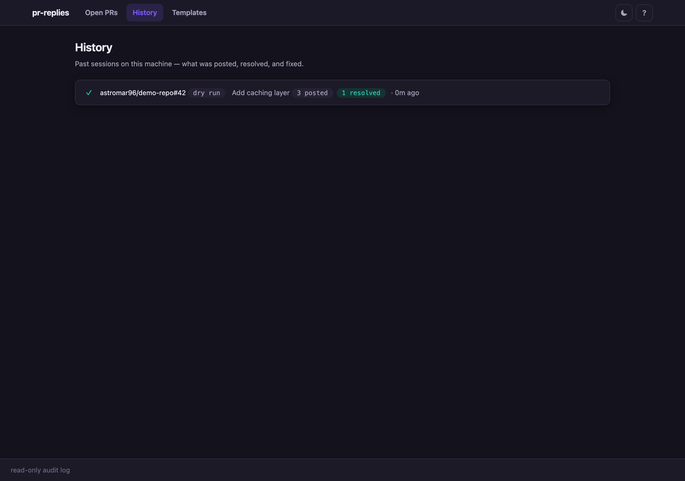

## Requirements

- **GitHub:** [`gh`](https://cli.github.com) installed and authenticated (`gh auth login`)
- **GitLab:** [`glab`](https://gitlab.com/gitlab-org/cli) installed and authenticated (`glab auth login`; self-managed: `--hostname your.gitlab.host`)
- **Node.js 18+** — no install, no build step
- **macOS, Linux, or Windows** — browser launch uses `open` / `xdg-open` / `start`

The provider is **auto-detected** from your git remote (github.com → GitHub;
gitlab.com or any `gitlab.*` host → GitLab); override with `--provider` / `--host`.

## Install

**Claude Code** (plugin):

```
/plugin marketplace add astromar96/pr-replies
/plugin install pr-replies@pr-replies
```

**OpenAI Codex** (skill) — clone the repo, then install the skills into
`~/.agents/skills`:

```
git clone https://github.com/astromar96/pr-replies
node pr-replies/scripts/install-codex.js
```

This bakes the checkout's path into the installed skills, so `/pr-replies` works
from any repo. Keep the clone in place (or set `PR_REPLIES_HOME` to its path);
re-run the installer after `git pull`. Invoke it in Codex with `$pr-replies` /
`$pr-dashboard`, via `/skills`, or just ask Codex to reply to your PR's comments.

## Usage

In any repo with an open PR (GitHub) or MR (GitLab):

```
/pr-replies                       # autodetect the PR/MR from the current branch
/pr-replies 42                    # PR/MR number in the current repo
/pr-replies https://github.com/owner/repo/pull/42
/pr-replies https://gitlab.com/group/project/-/merge_requests/42
/pr-replies --no-fix              # skip triage/fixes, go straight to replying
/pr-replies --dry-run             # full flow, but nothing is posted
/pr-replies --allow-cross-repo    # allow fixes on a fork PR you have checked out
/pr-replies --provider gitlab     # force the provider (else auto-detected)
/pr-replies --host gitlab.example.com   # self-managed GitLab host

/pr-dashboard                     # open the hub (history + templates), no PR needed
```

Only **unresolved** threads/discussions are shown. Comments you authored and bot
comments are filtered out of the general-comments list.

## Keyboard shortcuts

Keyboard-first — press `?` in any view for the full, in-context sheet. The common ones:

| Key | Action |
| --- | --- |
| `j` / `k` | Next / previous comment |
| `1` / `2` / `3` | Set **Fix** / **Reply** / **Skip** |
| `v` | Switch reply variant (Direct ↔ Humanized) |
| `e` | Edit guidance / draft |
| `t` | Insert a template |
| `o` | Toggle the diff |
| `/` | Filter comments |
| `⌘↩` | Continue / send |
| `g h` / `g t` / `g p` | Jump to **History** / **Templates** / active **PR** |
| `?` | Toggle this help |

Shortcuts are ignored while a text field is focused, by design.

## Configuration (optional)

`~/.config/pr-replies/config.json`:

```json
{
  "signature": "",
  "defaultTriageAction": null,
  "autoResolveFixedThreads": true,
  "sessionTimeoutMins": 120,
  "waitTimeoutSecs": 540,
  "historyMax": 200,
  "theme": "system",
  "agentLabel": null
}
```

- `signature` — appended to every posted reply (the UI shows a note).
- `defaultTriageAction` — preselected action when the agent has no suggestion (`"fix"` / `"reply"` / `"skip"`).
- `autoResolveFixedThreads` — pre-tick "Resolve thread" on fixed threads you can resolve.
- `sessionTimeoutMins` — how long the background session server lives without finishing.
- `waitTimeoutSecs` — default window for each blocking `wait` call.
- `historyMax` — how many session records to keep (oldest pruned; cap 2000).
- `theme` — `"light"` / `"dark"` / `"system"`; the in-browser toggle overrides this per browser.
- `agentLabel` — name shown in the UI for the agent driving the session (e.g. `"Codex"`, `"Claude"`); `null` shows the neutral "the agent".

Set `PR_REPLIES_CONFIG_DIR` to relocate config, history, and templates (the test
suite and UI preview use it so they never touch your real files).

## Privacy & security

- **Local only** — served from `127.0.0.1` behind a random per-session URL token, checked in constant time and guarded against DNS-rebinding via a Host-header check. No hosted server, no accounts, no telemetry.
- **Owner-only on disk** — session dirs are created `0700` and the token/content files `0600`, so other local users can't read the URL token or your review content.
- **Never handles tokens** — auth is delegated entirely to your `gh` / `glab` CLI and their existing credentials.
- **No payload in the HTML** — the browser fetches state over `GET /state` and `GET /events` (SSE).
- **Durable edits** — survive refreshes, timeouts, and a server restart (localStorage keyed by repo + PR, plus a resumable on-disk session).

## How it works

```
agent (command/skill)                server (background)                browser (one tab)
write triage.payload.json
serve --session DIR  ──────────────▶ boots, opens /{token}/       ◀──▶  triage view
wait --phase triage  (blocks)        user submits → phase=fixing  ───▶  progress view
emit --type fix_done … ────────────▶ events.jsonl → SSE           ───▶  live fix timeline
write reply.payload.json
advance --phase reply ─────────────▶ validates, attaches git diffs ──▶  reply view
wait --phase reply   (blocks)        posts via gh/glab (retry+resolve) ▶  per-item status
stop --session DIR
```

- **The workflow drives the flow.** A single agent-neutral source in `src/agent/` walks the agent through each step (Step 0 detects the provider; later steps branch between `gh` and `glab`); `npm run build:agents` generates both the Claude Code command (`commands/*.md`) and the Codex skill (`.agents/skills/*/SKILL.md`) from it, so the two runners never drift.
- **Provider-agnostic core.** Backends in `server/lib/providers/` sit behind a `createProvider` factory — `github.js` (`gh`) and `gitlab.js` (`glab`, REST-only) share a retry kernel and expose one interface (`postReviewReply` / `postIssueComment` / `resolveThread` / `listPrs`).
- **Zero-dependency server.** `server/server.js` is a CLI (`serve` / `wait` / `emit` / `advance` / `stop`, plus a read-only `suggest`) over stdlib libs. A session state machine (`triage → fixing → reply → done|cancelled`) persists everything atomically under `/tmp/pr-replies/`; `events.jsonl` doubles as the SSE replay log, so a refresh never loses state. `serve --home` is the same server with no session — a read-only data plane for the repo's open PRs, history, and templates.
- **No build step.** `server/ui/` is a React single page: vendored React + [htm](https://github.com/developit/htm) and the app modules are concatenated into one inline `<script>` at serve time, so there's nothing to compile or install.
- **Where replies land.** On GitHub, inline replies go **inside the review thread** (GraphQL `addPullRequestReviewThreadReply`, REST fallback), general comments become new top-level PR comments, and ticked threads resolve via `resolveReviewThread`. On GitLab the same maps to MR discussion replies, top-level notes, and resolving a discussion. Resolve failures are non-fatal.

## Timeouts & resume

Each `wait` blocks for up to 9 minutes (under a typical ~10-minute per-command
ceiling), but the session doesn't end with it — the agent just re-runs `wait`,
untouched. The server itself lives for `sessionTimeoutMins` (default 2 h); if it
dies, the agent relaunches with `serve --resume`, rebuilding state from the
session dir (posted replies stay locked) and restoring your in-browser edits
from localStorage.

## Development

```
git clone https://github.com/astromar96/pr-replies
claude --plugin-dir ./pr-replies          # Claude Code
node ./pr-replies/scripts/install-codex.js # OpenAI Codex

npm test          # Node's built-in runner (no network needed)
```

The Claude command (`commands/*.md`) and Codex skill (`.agents/skills/*/SKILL.md`)
are **generated** from `src/agent/*.workflow.md` — edit the source, then:

```
npm run build:agents   # regenerate both runners
npm run check:agents   # CI guard: fail if a generated file drifts from its source
```

Drive the full UI without GitHub or an agent:

```
scripts/demo.sh              # triage → scripted fix progress → dry-run replies
scripts/demo.sh reply-only   # the --no-fix fast path
scripts/demo.sh home         # the history / templates hub

npm run ui:preview           # boot the real server + drive every route with Playwright
```

`ui:preview` screenshots every route into the gitignored `test/ui/screenshots/`
and doubles as an integration test — any load-order / render / `ReferenceError`
regression makes a route throw and fails the run. The README images in
`docs/screenshots/` are a curated subset of that output.

## Contributing

Issues and PRs welcome. The codebase is intentionally dependency-free (stdlib
only; Playwright is the sole dev dependency), so please run `npm test` and
`npm run ui:preview` before opening a PR.

## License

[MIT](LICENSE)
</content>
